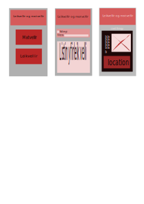

# For_The_Family_Web_App, # Verkefni fyrir áfanga VEFÞ3VÞ05DU.
FTF : For the Family (FF : Fyrir Fjölskylduna)

# UserStories:
   Hver notar síðuna:
- Foreldar sem langar að fara út á leikvelli/leikskóla/grunnskóla með börnin sín.
- Krakkar sem vilja hittast á leikvelli og leika saman eftir skóla/leikskóla.
- Umsjónar fólk sem er með börn í pössun.
- Hópfélag sem vill fara með krakkana á völl og skipulegja leiki á vellinum.
   
  Möguleikar:
  Gunnar á 2 krakka og er ekki með vinnu honum langar að gera einhvað en að hanga inni í dag með krökkunum sínum. Hann getur leitar af útisvæðum sem gætu mögulega haft rólur eða rennibrautir til að skemmta krökkunum um tíma.
  
  Möguleiki :
  Gunnar vill fara á veitingastað með krökkunum og konunni sinni, en krakkanir eru oft svo óronlegir að bíða eftir matinum sem getur tekið 10-30min að koma á borðið. Þá væri svo næs að veitingarstaðurinn væri með leiksvæði sem gæti dreift hug krakkana á meðan þaug bíða eftir matnum að koma á borðið.

<h3>Hverji munu nota síðuna/appið. </h3>
  * Krakkar.
  * Foreldrar.
  * Hóp skipulegjarar.
  * Almenningur.
  
<h3> Hvað er notandi að leitast eftir á síðunni/appinu. </h3>
 * Leiksvæði sem er við hæfi fyrir krakkan sinn / hópinn af krökkum.
 * Leiksvæði sem hentar hóp leikjum fyrir krakka.
 * Veitinga staði sem bjóða uppá skam skemmtun fyrir krakka til að stytta biðtíma.
 * Veitinga staði sem bjóða uppá upplifun fyrir krakkana þeirra.
<h3> Hvernig er viðmótið á síðunni? </h3

* Gerið Wireflows (Wireframes + User flows) á pappír fyrir appið. Takið ljósmyndir af skissum.

# Source Material ##
* https://reykjavik.is/allir-leikskolar

#Staflar:
 - HTML = Htmlx
 - JS = Django
 - CSS = Windtail
 - Database = SQL or firebase
