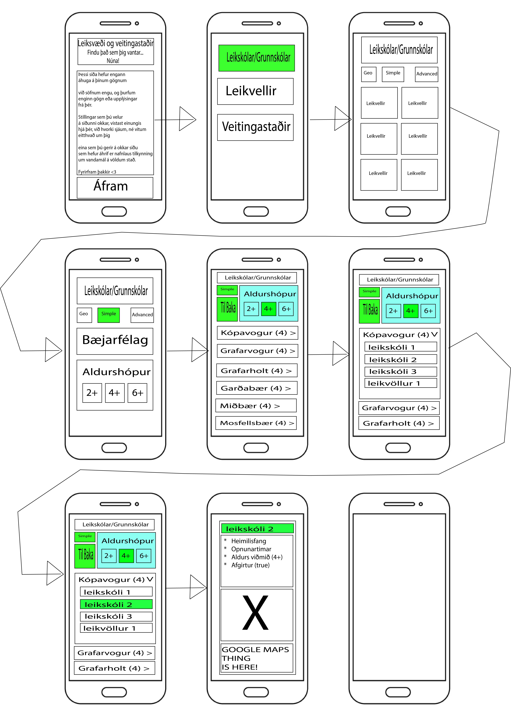
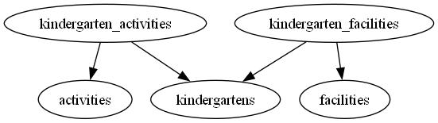

# For The Family
  -link on page <--vantar.

## Vefsíðu Virkni :
- ### Hver notar síðuna:
  - Foreldrar sem langar að fara út á leikvelli/leikskóla/grunnskóla með börnin sín.
  - Krakkar sem vilja hittast á leikvelli og leika saman eftir skóla/leikskóla.
  - Umsjónarfólk sem er með börn í pössun.
  - Hópfélag sem vill fara með krakkana á völl og skipuleggja leiki á vellinum.

- Notenda dæmi :
  - Gunnar á 2 krakka og er ekki með vinnu honum langar að gera eitthvað annað en að hanga inni í dag með krökkunum sínum. 
    Hann getur leitað af útisvæðum sem gætu mögulega haft rólur eða rennibrautir til að skemmta krökkunum um tíma.
    
  - Gunnar vill fara á veitingastað með krökkunum og konunni sinni, en krakkanir eru oft svo óroólegir að bíða eftir matnum, sem getur tekið sinn tíma miðað við stærð veitingarstaðsins og fjölda fólks á staðnum.
    Þá væri svo virkilega gott að veitingarstaðurinn væri með leiksvæði sem gæti dreift huga krakkana á meðan þau bíða eftir matnum.
  
# Hvað er notandi að leitast eftir á síðunni/appinu. 
 
   * Leiksvæði sem er við hæfi fyrir krakkan sinn / hópinn af krökkum.
   * Leiksvæði sem hentar hóp leikjum fyrir krakka.
   * Veitinga staði sem bjóða uppá skam skemmtun fyrir krakka til að stytta biðtíma.
   * Veitinga staði sem bjóða uppá upplifun fyrir krakkana þeirra.

# Hvernig er viðmótið á síðunni?

   * Gerið Wireflows (Wireframes + User flows) á pappír fyrir appið. Takið ljósmyndir af skissum.
   * Due to how github handles images it places black spaces inbetween the "phones" making it a little harder to see the arrows.

  * Eftir uppsetningu á síðunni:

# gagnagruns meðhöndlun.
  * SQL-server var notaður til þess að hýsa upplýsingar í gegnum PostGRES
  * hér fyrir neðan má sjá mynd af sambands tenginum í gagnasafninu.

# Source Material
 * https://reykjavik.is/allir-leikskolar

# Staflar:
- Gagnagrunur og Bakendi verður byggður á Flask, þar sem verður notast við bæði "Blueprints" og "Class" til þess að einfalda kóðunn og gera hann auðveldari
  til þess að vinna með og stæka í framtíðinni.
- Gagnagrunurinn verður með mestum líkindum Firebase-RTDB eða SQL-DB, er ekki 100% ákveðið ennþá.
- fyrir CSS munum vera notað Windtail, þar sem það lítur út fyrir að vera einfalt og auðvelt að læra og er mjög nútímalekt.

# Framhald og óklárað efni:
- Óklárað flokkar s.s Grunnskólar og Leiksvæði.
- Bæta við Veitingastöðum og öllu sem tengst því.
- Bæta við afreyingar stöðum í bæjarfélögum fyrir fjölskyldur.
- Og margt fleira sem hugmyndar flugið leyfir!

&copy; Haust:2024. Asmodeus, Diljá, Örn - VEFÞ3VÞ05DU-HÁT - Tölvubraut - <a style="text-decoration:none" href="https://tskoli.is/">Tækniskólinn, Icelandic college of technology</a>
